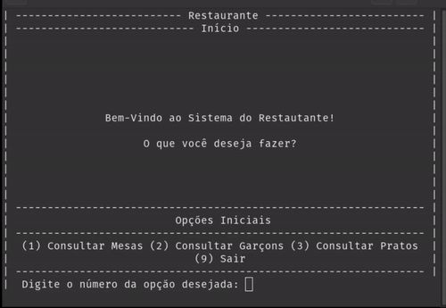

# CLI-Sistema-de-Restaurante

Este é um simples sistema de restaurante em CLI escrito em C.

# Sobre
Este é um projeto de um sistema de restaurante multiplataforma escrito em C para a disciplina Linguagem de Programação I de minha faculdade. Achei o resultado interessante e resolvi publicar.

A proposta do trabalho é treinar os conceitos de lista simplesmente encadeada, duplamente encadeada, entrada/saída de dados e manipulação de arquivos em disco.

Note que este sistema é recomendado para fins acadêmicos somente. Devido as limitações impostas (CLI, multiplataforma, sem banco de dados dedicado, sem utilizar bibliotecas não-standard, etc) o sistema não funcionará bem por longos períodos ou quantidade de dados médias-grandes.

# Fucionalidades
- Listar / Consultar / Inserir / Excluir mesas;
- Listar / Consultar / Inserir / Excluir pedidos;
- Listar / Consultar / Inserir / Excluir garçons;
- Listar / Consultar / Inserir / Excluir pratos no menu do restaurante;
- Salvar e carregar os pratos e os garçons em disco. Alterações feitas em tempo de execução serão automaticamente salvas;
- Gerar uma pseudo-nota fiscal, contendo todos os itens comprados, suas quantidades e valores, o valor total da compra e o garçom responsável.

Note que cada mesa tem sua fila individual de pedidos e é associada com um garçom.
Cada pedido salvo na mesa contém a quantidade comprada do item e seu respectivo preço.
